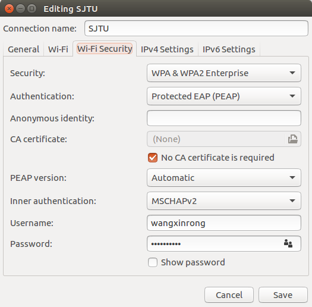

# Rebuild my Ubuntu

## connect to SJTU using Jaccount

choose SJTU

1. set `Authentication` to `Protected EAP(PEAP)`

2. choose `No CA certificate is required`

3. set `Inner autentication` to `MSCHAPv2`

4. input username and password.



## set apt-get server

go to `System Settings -> Software & Updates` choose the Download from server.

## Git

1. `sudo apt-get install git`

2. Then add following scripts in .bashrc:

```bash
# git
alias gc='git commit -am'
alias gps='git push'
alias gpl='git pull'
alias ga='git add'
alias gs='git status'
```

3. set git configs on ids

```bash
git config --global user.email "imbaguanxin@
```

## Sogou Pinyin

1. dependencies

```bash
sudo apt-get install fcitx fcitx-config-gtk fcitx-table-all im-switch
sudo apt-get install libopencc1 fcitx-libs fcitx-libs-qt fonts-droid-fallback
```

2. install Chinese support

go to `System Settings -> Language Support -> Install/Remove Language -> install Chinese`

3. config Input Method

Since Sogou Pinyin is built on `Fcitx`, we need to change the input method to fcitx instead of default methods (probably IBUS).

* go to `Input Method Configuration`

```bash
im-config
```
press `ok` -> `yes` -> select fcitx -> `ok` -> `ok`

then reboot the system
```bash
sudo reboot
```

4. install sogou

go to the official cite of sogou pinyin linux version and download the source.

install the .deb package

```bash
sudo dpkg -i sogoupinyin_*.deb
```

This may result in errors since some dependencies are not installed.

use following command to fix (please refer to the warning/error message and the instructions on fixing the problem provided by system).

```bash
sudo apt-get -f install
```

4. config fcitx and sogou

go to Fcitx Configuration

```bash
fcitx-config-gtk3
```

***OR*** search `fcitx configuration` in applications

Press the `Plus` button at the lower left conner and search for `sogou`. Then add `Sogou Pinyin`  as input method.

Then reboot computer. All should be fine now.

## install Java

* **jdk 13**:

  Since there is a deb package from oracle, we can use dpkg to install.

  1. download jdk from oracle

  2. install the deb package:

  ```bash
  # install the deb package
  sudo dpkg -i jdk-13.*.deb
  # resolve the dependencies problem
  sudo apt-get -f install
  ```

    After the installation, we should find new folder: `/usr/jvm/jdk_13*`.

  3. config path variable

  add following scripts to `.bashrc` (using `gedit ~/.bashrc`)

  ```bash
  # Java 13
  export JAVA_HOME=/usr/lib/jvm/jdk-13.0.1
  export PATH=$PATH:$JAVA_HOME/bin
  ```

* **jdk 8**:

  1. download the tar.gz file

  2. unzip the packed java to /usr/java

  ```bash
  sudo mkdir /usr/java
  cd /usr/java
  sudo tar -zxvf ~/Downloads/jdk-8*.tar.gz
  ```

  3. set java environment
  ```bash
  # java 8
  JAVA_HOME=/usr/java/jdk1.8.0_231
  JRE_HOME=/usr/java/jdk1.8.0_231/jre
  CLASS_PATH=.:$JAVA_HOME/lib/dt.jar:$JAVA_HOME/lib/tools.jar:$JRE_HOME/lib
  PATH=$PATH:$JAVA_HOME/bin:$JRE_HOME/bin
  export JAVA_HOME JRE_HOME CLASS_PATH PATH
  ```
  Then source ~/.bashrc

* Install intellij


## install R

* **install r**

`sudo apt-get install r-base`

* **install RStudio**

download r studio package

`sudo dpkg -i sudo dpkg -i rstudio*.deb`

* **configurate RStudio**

  1. **change Theme**

    Tools -> Global Options -> Appearance -> Editor Theme

  2. **auto completion**

    Tools -> Global Options -> Code -> completion

    Set `Completion Delay` to 1 chr and 0 ms

  3. **change CRAN source**

    Tools -> Global Options -> Packages -> Primary CRAN repository

    Change the repository to a server near you.

## install Python


* Install Pycharm

unpack the souce file to what you like

```bash
sudo mkdir -p ~/ides/pycharm
cd ~/ides/pycharm
sudo tar -zxvf ~/Downloads/pycharm*.tar.gz
sudo sh pycharm*/bin/pycharm.sh
```
